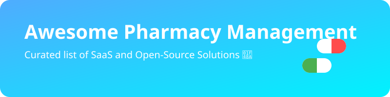

  

  
  

# 🚀 Awesome Pharmacy Management Systems

**A Curated List of SaaS Products & Open-Source GitHub Projects for Pharmacy Software**  
*Focused on Pharmacy Management Systems (PMS), Dispensing, Inventory, Workflow & Independent Pharmacy Operations* 🏥💊  
**Last updated: August 2026**

This repository tracks notable **SaaS platforms** and **open-source projects** for **Pharmacy Management**. These tools support prescription processing, dispensing, inventory control, claims adjudication, patient profiles, workflow management, and overall operations for independent, retail, and specialty pharmacies. It is highly optimized for developers, clinic operators, and healthcare technologists looking for the best tools in the pharmacy tech space.

## 📑 Table of Contents
- [🏢 SaaS/Hosted Platforms](#saas-products)
- [🌐 Open-Source GitHub Projects](#open-source-github-projects)
- [🤝 How to Contribute](#how-to-contribute)
- [⚠️ Disclaimer](#disclaimer)
- [📈 Star History](#star-history)

---

## 🏢 SaaS/Hosted Platforms (Sorted by Estimated Company Size)

| Product | Description | Pricing | Free Tier Limit | Company Size (Estimated) |
| :--- | :--- | :--- | :--- | :--- |
| **[PioneerRx](https://www.pioneerrx.com/)** (RedSail Technologies) | 🌟 Feature-rich pharmacy management system widely regarded as a market leader for independent pharmacies, offering advanced dispensing, clinical tools, workflow customization, inventory, and patient care features. | Contact for pricing | N/A | $100M+ |
| **[ScriptPro](https://www.scriptpro.com/)** | 🤖 Pharmacy automation and management solutions combining robotics with software for high-volume and efficient dispensing operations. | Contact for pricing | N/A | $100M+ |
| **[Rx30](https://www.rx30.com/)** | 💼 Pharmacy management software focused on independent pharmacies with dispensing, inventory, and workflow capabilities. | Contact for pricing | N/A | $90M+ |
| **[QS/1 (NRx)](https://www.qs1.com/)** | 🏥 Established pharmacy management platform (now part of broader RedSail offerings) supporting dispensing, claims, and pharmacy operations. | Contact for pricing | N/A | $80M+ |
| **[PrimeRx](https://www.primerx.com/)** (Micro Merchant Systems) | 📊 Comprehensive pharmacy management platform covering prescription intake, dispensing, inventory, billing, patient engagement, and support for retail, specialty, LTC, and compounding workflows. | Contact for pricing | N/A | $50M+ |
| **[Computer-Rx](https://www.computer-rx.com/)** | 💻 Pharmacy management system providing prescription processing, inventory, and business tools for retail pharmacies. | Contact for pricing | N/A | $40M+ |
| **[Liberty Software](https://www.libertysoftware.com/)** | 🗽 Pharmacy management solution focused on independent pharmacies with strong dispensing, inventory, and operational tools. | Contact for pricing | N/A | $30M+ |
| **[Datascan / WinPharm](https://www.datascan.com/)** | 📈 Long-standing pharmacy management and POS solutions used by independent pharmacies for dispensing and front-end operations. | Contact for pricing | N/A | $20M+ |
| **[BestRx](https://www.bestrx.com/)** | 🏆 Affordable and capable pharmacy management software popular with smaller independent pharmacies for core dispensing and workflow needs. | Contact for pricing | N/A | $15M+ |

---

## 🌐 Open-Source GitHub Projects (Sorted by GitHub Stars)

- **[ERPNext](https://github.com/frappe/erpnext)** (+ Healthcare / Pharmacy modules)   
  Powerful open-source ERP that can be extended for pharmacy inventory, POS, purchasing, batch/expiry tracking, and basic dispensing workflows; one of the most mature foundations for custom pharmacy systems.

- **[HospitalRun](https://github.com/HospitalRun/hospitalrun-frontend)**   
  Modern hospital information system which includes a pharmacy module for managing medication stock and dispensing for clinics.

- **[Bahmni](https://github.com/Bahmni/bahmni-core)**   
  Open-source hospital management system featuring robust modules for pharmacy operations, prescription integration, and inventory control.

- **[OpenBoxes](https://github.com/openboxes/openboxes)**   
  Open-source inventory and supply-chain management system built for healthcare settings, with strong support for lot tracking, expiry alerts, multi-facility stock, and pharmacy/warehouse use cases.

- **[Pharmacy-Management-System](https://github.com/SammyOngaya/Pharmacy-Management-System)**   
  Open-source POS and inventory solutions designed for small-to-medium pharmacies and chemists, including sales, stock control, and basic reporting.

- **[PharmaHub](https://github.com/kanhaiya-gupta/PharmaHub)**   
  Community-built open-source pharmacy and medical-store management systems with multi-store support, inventory, sales, purchase tracking, and dashboards.

- **[OPENeP](https://github.com/AppertaFoundation/openep)**   
  Open-source electronic prescribing and medication management system covering reconciliation, prescribing, pharmacist review, and administration — useful as a complementary component to pharmacy operations.

- **[OpenMRS Dispensing](https://github.com/openmrs/openmrs-esm-dispensing-app)**   
  Open-source medication dispensing functionality within the OpenMRS ecosystem, suitable for clinic and hospital pharmacy workflows integrated with electronic medical records.

- **[PharmaOS](https://github.com/Skillyme-Cohort-1/pharmaOS)**   
  Modern open-source pharmacy internal management systems covering inventory, expiry tracking, POS/sales, orders, customers, suppliers, and analytics.

- **[OpenMRS-DrugOrders-Pharmacy](https://github.com/HariniParth/OpenMRS-DrugOrders-Pharmacy)**   
  Modules and systems focused on drug orders, pharmacy review, and e-prescription workflows that can integrate with broader pharmacy management stacks.

### ➕ Additional Strong Open-Source Options
- **Odoo Community** with pharmacy/inventory/POS modules for customizable retail pharmacy operations.
- **Batch/expiry and inventory-focused tools** that emphasize FEFO, alerts, and multi-location stock control.

---

## 🤝 How to Contribute
1. Fork the repo.
2. Add/edit entries in `README.md` (follow existing format).
3. Submit PR with a short explanation.

Star the repo if you find it useful!

---

## ⚠️ Disclaimer
- This is a **community-curated** list — not exhaustive and not an endorsement.
- Any self-hosted or open-source solution must be carefully validated for local legal, regulatory, and clinical safety requirements before production use.

---

**Made for independent pharmacists, pharmacy owners, developers, clinic operators, and healthcare technologists.**  
Let's make pharmacy operations software more transparent, flexible, and open.

## 📈 Star History

<a href="https://www.star-history.com/?repos=ishandutta2007%2FAwesome-Pharmacy-Management&type=date&legend=bottom-right">
<picture>
<source media="(prefers-color-scheme: dark)" srcset="https://api.star-history.com/chart?repos=ishandutta2007/Awesome-Pharmacy-Management&type=date&theme=dark&legend=bottom-right" />
<source media="(prefers-color-scheme: light)" srcset="https://api.star-history.com/chart?repos=ishandutta2007/Awesome-Pharmacy-Management&type=date&legend=bottom-right" />

</picture>
</a>

